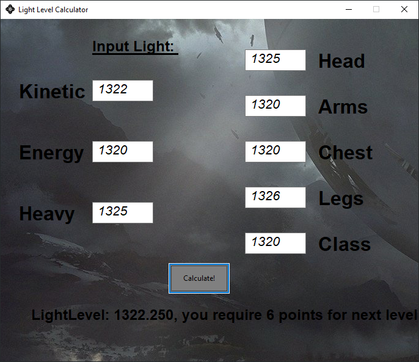

This is an old simple project done in early may 2020. Uploading simply for future reference.
It uses the library WxWidgets for creating a very simple GUI that calculates floor of the average between all entries, and how many you need to increase the average by an integer.

It was designed thinking of the game __Destiny 2__ so that you can calculate the points needed to increase your light level by one.  
Done for learning purposes, and a very easy and quick tool to calculate these numbers. Many of these can be found online anyways. Useful if want a quick reference / example of WxWidgets.

Feel free to use this in any way you like.